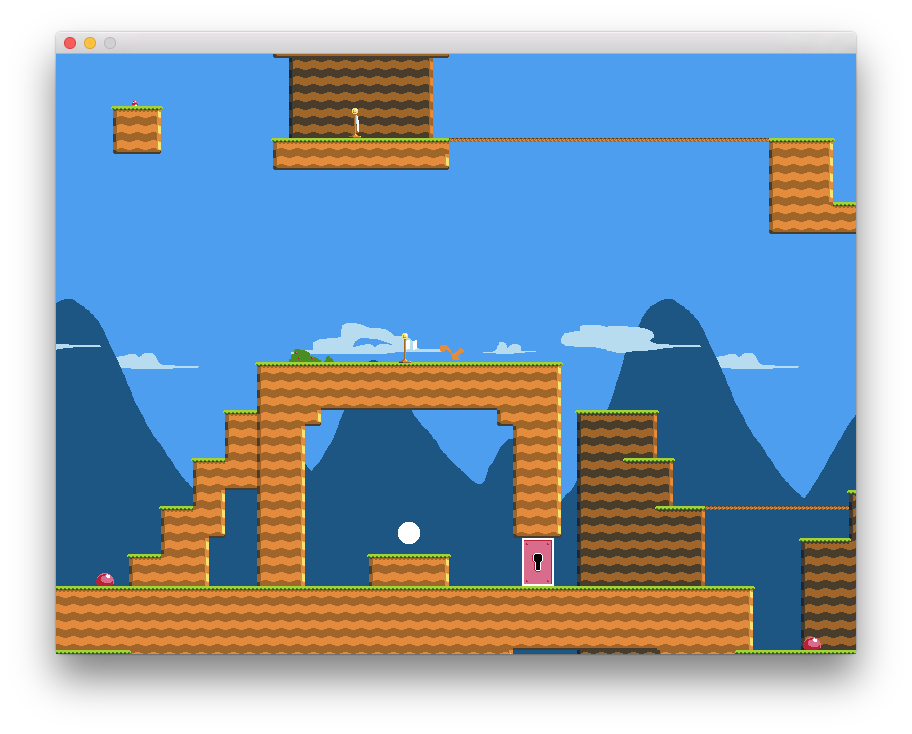
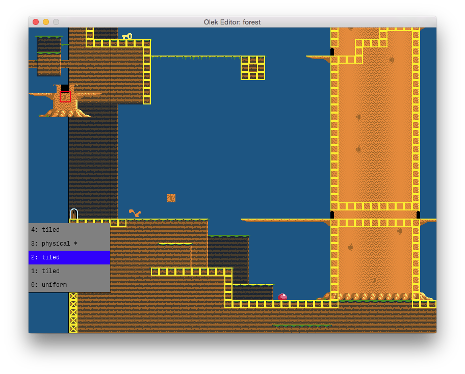

Olek
====

This is exploration platformer game written in OCaml. It was done as an experiment to train my functional
programming skills and create a non-trivial interactive application in a fuctional language. Also contained
is a full featured level editor. It was my final project for the Functional Programming course during
2014/15 at Univerity of Wrocław.

Build
=====

Instructions
============

The key bindings in the _game_ are as follows:

  * **Left/Right arrows:** Move around
  * **Space:** Jump
  
While in the _editor_:

  * **WASD keys:** Change the active tile stamp
  * **Up/Down arrows:** Change the active layer
  * **Shift + Up/Down:** Reorder layers
  * **E:** Display only the active layer
  * **Return:** Show terminal
  * **Right mouse button:** Place a tile
  * **Mouse move while RMB down:** Drag backgrund image
  * **Shift + Mouse move while RMB down:** Drag camera

Most operations in the editor are available only through the built-int mini terminal. The terminal is
activated with **Return** and the commands are confirmed with **Return** or rejected with **Esc**.
The following commands are recognized:

  * `new <room_name> <row_cnt> <column_cnt>`: Create a new room
  * `load <room_name>`: Open an existing room file
  * `save [<room_name>]`: Save the room. Uses current name if none specified.
  * `mode obj` or `mode world`: Switch between editing of objects (mobs) and world (tiles, bg, etc.)
  * `show tiles` or `hide tiles`: Show or hide the physical layer
  * `add uniform layer <r> <g> <b>`: Add a background layer with a uniform color
  * `add image layer <image_name>`: Add an image background using `data/backgrounds/<image_name>.png`
  * `add tiled layer`: Add a tiled layer
  * `rem layer`: Remove active layer
  * `set repeat <repeat>`: Set the repeat pattern of an image layer; <repeat> ca be: `xy`, `x`, `y`, or `-`
  * `set parallax <number>`: Set parallax of an image layer
  * `add obj <obj_kind>`: Add an object of the specified kind. The _kinds_ are roughly the names of
    the files residing in `src/minds` without the `.ml` extension.
  * `set name <name>`: Set the name of the active object
  * `edit init`: Edit the _init_ structure of the active object
  * `rem obj`: Remove the active object
  
Some command work only if in certain mode (_obj_ or _world_) or for certain kinds of layers.

The game is autosaved. If you want to start from the beginning, just remove the `continue.save` file from
`data/saves`.
